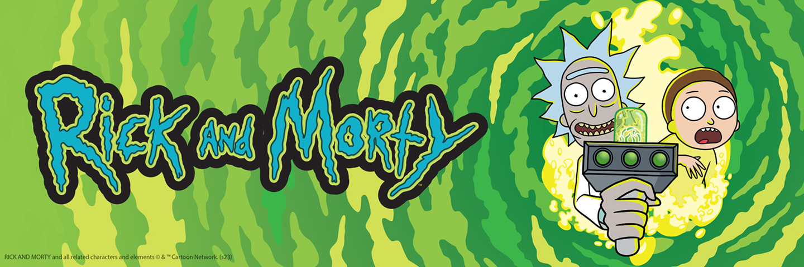

# Rick & Morty Characters List



## 📋 Обзор проекта

**Rick & Morty Characters List** — это учебный проект, разработанный для изучения и практики современных технологий веб-разработки. Приложение позволяет просматривать, фильтровать и получать подробную информацию о персонажах из популярного мультсериала "Рик и Морти".

> ⚠️ **Важно**: Данный проект создан исключительно в образовательных целях. Через его разработку я изучаю веб-разработку, React, Next.js и другие современные технологии.

## ✨ Основной функционал

- **Список персонажей** с постраничной навигацией
- **Фильтрация персонажей** по имени, статусу (живой, мертвый, неизвестно) и полу
- **Детальная страница персонажа** с информацией о:
  - Статусе и поле
  - Местоположении
  - Эпизодах, в которых появлялся персонаж
- **Слайдер персонажей** из того же местоположения
- **Адаптивный дизайн** для различных устройств

## 🛠️ Технологический стек

- **Next.js 14** (App Router) — фреймворк React для создания полнофункциональных веб-приложений
- **React 18** — библиотека для создания пользовательских интерфейсов
- **TypeScript** — типизированный JavaScript для улучшения разработки
- **Redux Toolkit** — управление состоянием приложения
- **RTK Query** — управление данными и кэширование запросов к API
- **Tailwind CSS** — утилитарный CSS-фреймворк для стилизации

## 🚀 Установка и запуск проекта

### Предварительные требования

- Node.js (версия 18 или выше)
- npm или yarn (предпочтительно npm)

### Шаги установки

1. **Клонируйте репозиторий**

```bash
git clone https://github.com/yourusername/rick-and-morty-characters-list.git
cd rick-and-morty-characters-list
```

2. **Установите зависимости**

```bash
npm install
# или
yarn install
```

3. **Запустите проект в режиме разработки**

```bash
npm run dev
# или
yarn dev
```

4. **Откройте проект в браузере**

Перейдите по адресу [http://localhost:3000](http://localhost:3000)

### Сборка для продакшена

```bash
npm run build
# или
yarn build
```

### Запуск собранного проекта

```bash
npm start
# или
yarn start
```

## 📁 Структура проекта

```
rick-and-morty-characters-list/
├── public/               # Статические файлы
├── src/                  # Исходный код
│   ├── app/              # Страницы приложения (App Router)
│   │   ├── character/    # Страница с информацией о персонаже
│   │   ├── global.css    # Глобальные стили
│   │   ├── layout.tsx    # Главный макет приложения
│   │   ├── page.tsx      # Главная страница
│   ├── components/       # React компоненты
│   ├── hooks/            # Кастомные React-хуки
│   ├── services/         # API сервисы и работа с данными
│   ├── store/            # Redux стор и редьюсеры
│   ├── types/            # TypeScript типы и интерфейсы
│   ├── providers.tsx     # Провайдеры для приложения
```

### Ключевые компоненты

- **CharactersList** — отображает список персонажей с фильтрацией и пагинацией
- **Card** — карточка персонажа в списке
- **Filter** — компонент для фильтрации персонажей
- **CharacterPage** — страница детальной информации о персонаже
- **CharactersSlider** — слайдер с персонажами из одного местоположения
- **EpisodesTable** — таблица с эпизодами, где появляется персонаж

### Кастомные хуки

- **useUrlParams** — для управления параметрами URL
- **useCharactersData** — для получения данных о персонажах из одного местоположения
- **useSlider** — для управления слайдером персонажей

## 🔄 API

Приложение использует общедоступный [Rick and Morty API](https://rickandmortyapi.com/) для получения информации о:

- Персонажах
- Местоположениях
- Эпизодах

## 📚 Полезные ресурсы

- [Официальная документация Next.js](https://nextjs.org/docs)
- [React документация](https://reactjs.org/docs/getting-started.html)
- [Redux Toolkit](https://redux-toolkit.js.org/)
- [Tailwind CSS](https://tailwindcss.com/docs)
- [Rick and Morty API](https://rickandmortyapi.com/documentation)

## 🙏 Благодарности

Особая благодарность [Axel Fuhrmann](https://github.com/afuh) за создание и поддержку Rick and Morty API, который делает этот проект возможным.

## 📝 Планы на будущее

- Написание тестов
- Добавление адаптивной вёрстки

## 📄 Лицензия

[MIT](LICENSE)

---

Создано с ❤️ для изучения веб-разработки и React с Next.js.
